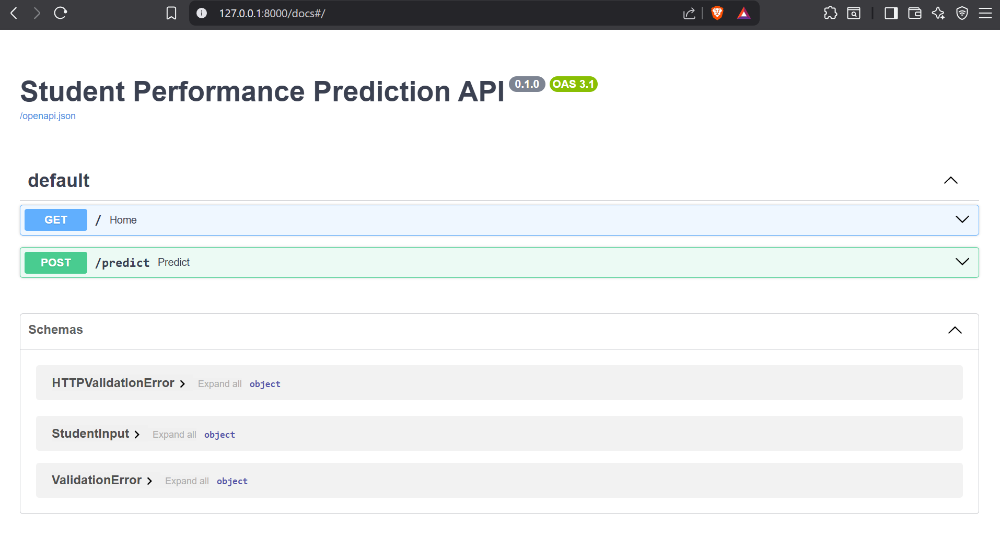
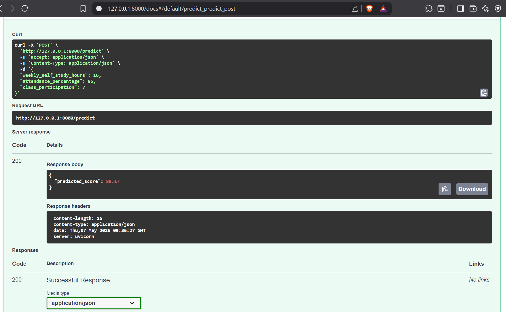

# Student Performance Prediction API

Machine learning based REST API for predicting student academic performance using FastAPI and Scikit-learn.

---

## Features

- Built a machine learning based REST API using FastAPI

- Predicts student academic performance using structured educational data

- Uses Random Forest Regression for score prediction

- Supports real-time prediction requests

- Returns JSON-based prediction responses

- Includes interactive Swagger API documentation

---

## Tech Stack

- Python

- FastAPI

- Scikit-learn

- Pandas

- Matplotlib

- Joblib

---

## API Documentation

### Swagger UI



---

## Prediction Endpoint

### POST `/predict`

### Sample Input

```json

{

  "weekly_self_study_hours": 16,

  "attendance_percentage": 85,

  "class_participation": 7

}

```

### Sample Response

```json

{

  "predicted_score": 89.17

}

```

### Prediction Response Screenshot



---

## Project Structure

```text

student-performance-prediction-api

│

├── notebook

│   └── Student_Performance_Prediction_Project.ipynb

│

├── screenshots

│   ├── api-docs.png

│   └── prediction-response.png

│

├── [app.py](http://app.py)

├── train_[model.py](http://model.py)

├── model.pkl

├── student_performance.csv

├── [README.md](http://README.md)

└── .gitignore

```

---

## Run Locally

### Clone Repository

```bash

git clone [https://github.com/asthasinghcs/student-performance-prediction-api.git](https://github.com/asthasinghcs/student-performance-prediction-api.git)

```

### Install Dependencies

```bash

pip install fastapi uvicorn scikit-learn pandas matplotlib joblib

```

### Run API Server

```bash

uvicorn app:app --reload

```

### Open API Docs

```text

[http://127.0.0.1:8000/docs](http://127.0.0.1:8000/docs)

```

---

## Model Information

- Model Used: Random Forest Regressor

- Features:

  - weekly_self_study_hours

  - attendance_percentage

  - class_participation

- Target:

  - total_score

---

## Future Improvements

- Model deployment on cloud platforms

- Frontend integration

- Better feature engineering

- Hyperparameter tuning

- Authentication and API security
